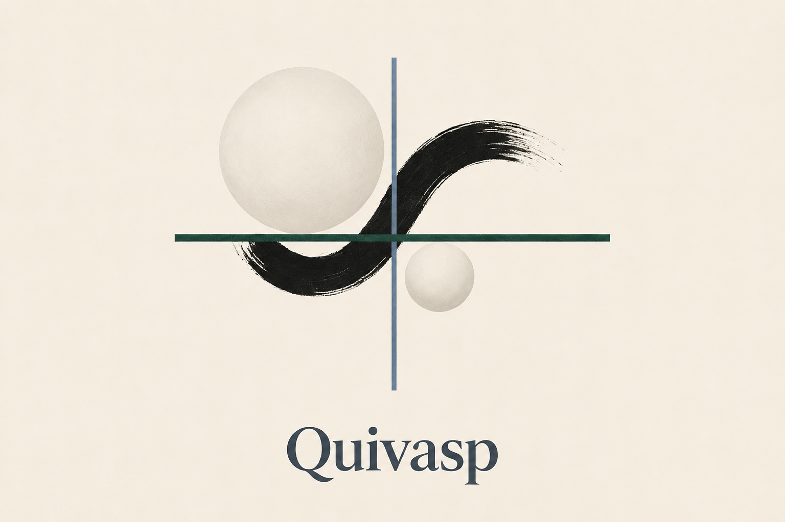

# Quivasp

Quivasp is an open-source Python package for VASP-related workflows, data processing, and analysis.

The project is currently under active development. Its goal is to provide simple and reusable tools for working with VASP calculations and related scientific workflows.

## Installation

Clone the repository:

```bash
git clone https://github.com/timeti123553/Quivasp.git
cd Quivasp
```

Install Quivasp in editable mode:

```bash
python -m pip install -e .
```

## Requirements

Quivasp requires Python 3.9 or later.

Band-structure analysis uses NumPy and Matplotlib; both are installed with
Quivasp.

## Usage

After installation, Quivasp can be imported in Python:

```python
import quivasp

print(quivasp.__version__)
```

## Band structures

Load a VASP line-mode calculation and create a publication-ready figure:

```python
from quivasp import BandStructure

bands = BandStructure.from_vasp("path/to/calculation")
print(bands.energies.shape)       # (spin, k-point, band)
print(bands.efermi)               # absolute Fermi energy in eV
print(bands.shifted_energies)     # energies referenced to E_F = 0 eV

figure, axis = bands.plot(
    ylim=(-4, 4),
    colors=("#174A7E", "#C44E52"),
    output="band_structure.png",
    dpi=300,
)
```

`BandStructure.from_vasp` accepts either a calculation directory or a direct
path to `vasprun.xml`. It automatically reads a neighboring line-mode
`KPOINTS` file when present, preserving high-symmetry labels such as Γ, M, and
K. Parsing and plotting are separate, so the k-path, raw eigenvalues,
occupations, Fermi energy, and shifted eigenvalues are all available for
downstream analysis.

For a one-call workflow:

```python
from quivasp import plot_band_structure

figure, axis = plot_band_structure(
    "path/to/calculation",
    ylim=(-2, 2),
    linewidth=1.2,
    output="bands.pdf",
)
```

The plotting API supports custom energy ranges, figure sizes, line widths,
spin colors, high-symmetry labels, Fermi-line visibility, output paths,
formats, and DPI. It returns the Matplotlib figure and axes for further
customization.

## Project Structure

```text
Quivasp/
├── src/
│   └── quivasp/
│       ├── __init__.py
│       └── band_structure.py
├── tests/
│   └── test_basic.py
├── README.md
├── pyproject.toml
├── CITATION.cff
├── LICENSE
└── .gitignore
```

The main source code is located in:

```text
src/quivasp/
```

Tests are located in:

```text
tests/
```

## Development

Clone the repository and install it in editable mode:

```bash
git clone https://github.com/timeti123553/Quivasp.git
cd Quivasp
python -m pip install -e .
```

To run tests, install the test extra:

```bash
python -m pip install -e ".[test]"
pytest
```

## Contributing

Contributions, suggestions, and bug reports are welcome.

If you would like to contribute, you can:

1. Fork the repository.
2. Create a new branch.
3. Make your changes.
4. Add or update tests when appropriate.
5. Submit a pull request.

For bugs or feature requests, please open an issue on GitHub.

## Citation

If you use Quivasp in academic or scientific work, please cite the software.

Citation information is provided in the `CITATION.cff` file. GitHub can also use this file to generate citation information through the **Cite this repository** feature.

## License

Quivasp is released under the MIT License.

You may use, modify, and redistribute the software under the terms of the license. Please retain the required copyright and license notices when redistributing the software.

See the `LICENSE` file for details.

## Disclaimer

Quivasp is an independent open-source project and is not affiliated with, endorsed by, or maintained by the official VASP development team.

VASP is a separate software package developed and distributed by its respective authors and institutions.
